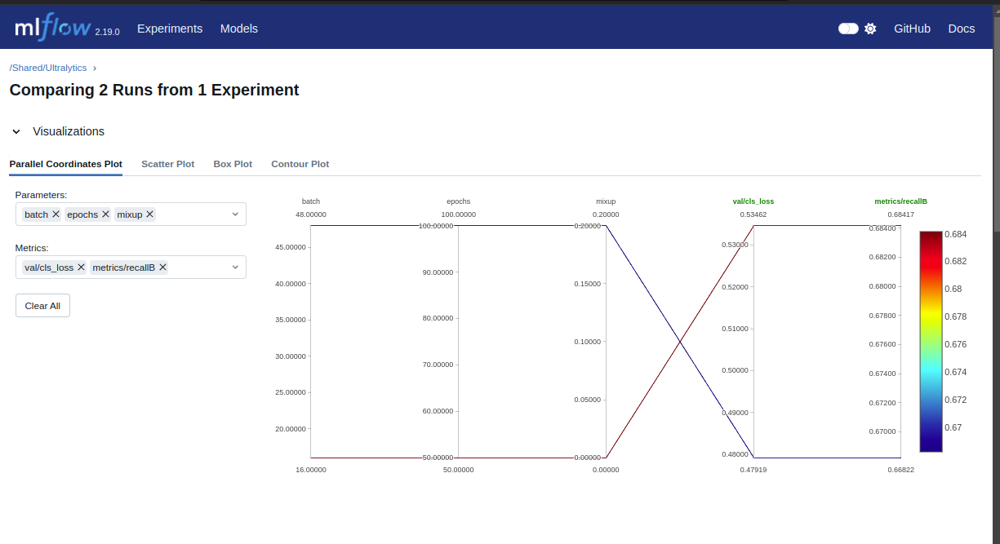
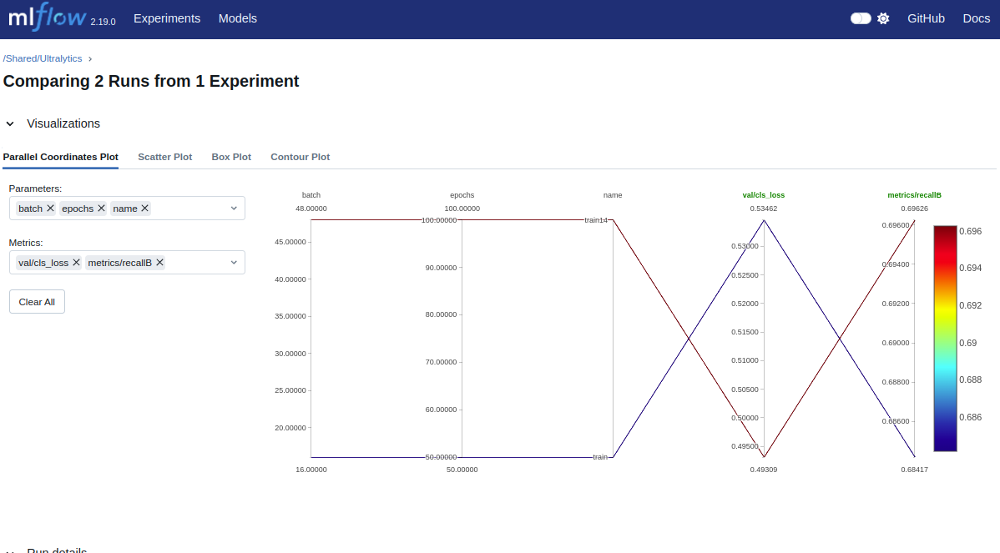

# Drone Face Detection with YOLO and MLOps Integration

This project implements a drone face detection system using YOLO (You Only Look Once) object detection with MLOps practices integrated through MLflow.

## Project Structure

```
.
├── data.yaml            # Dataset configuration
├── models/             # Model directory
│   └── yolo11m.pt      # YOLO model file
├── Notebook.ipynb      # Training and experimentation notebook
└── README.md           # Project documentation
```

## Dataset

The dataset consists of drone face images and was downloaded using Roboflow. To visualize the data, the project uses matplotlib to display random samples from the training set.

## Training Pipeline

### Initial Training
- Used YOLO11n as base model
- Trained for 50 epochs
- MLflow integration for experiment tracking
- Metrics tracked: mAP, recall, precision

### Hyperparameter Tuning

First Tuning:
- Learning rate: [0.001, 0.01]
- Translation augmentation: 0.2
- Epochs: 100
- Batch size: 16
- Results showed reduced performance with mixup augmentation

Second Tuning:
- Translation: 0.02
- Learning rate: 0.01
- Epochs: 100
- Batch size: 48
- Achieved improved results with lower validation loss and higher recall

## Results Visualization

Training metrics and model performance can be viewed in MLflow:



## Notes

1. For military/surveillance applications, recall takes precedence over precision due to the critical nature of false negatives
2. For civilian applications, the balance between precision and recall can be adjusted based on specific use cases
3. The model's performance showed room for improvement through:
    - Extended training epochs
    - Data augmentation techniques
    - Hyperparameter optimization

## Future Work

Development of a custom library for image and bounding box augmentation is planned to enhance the dataset and potentially improve model performance.

## Requirements

- Python 3.x
- PyTorch
- Ultralytics YOLO
- MLflow
- Matplotlib
- PyYAML

## Usage

1. Install dependencies
2. Configure data.yaml with dataset paths
3. Run training notebook
4. Monitor experiments through MLflow UI

For detailed implementation, refer to the Notebook.ipynb file.